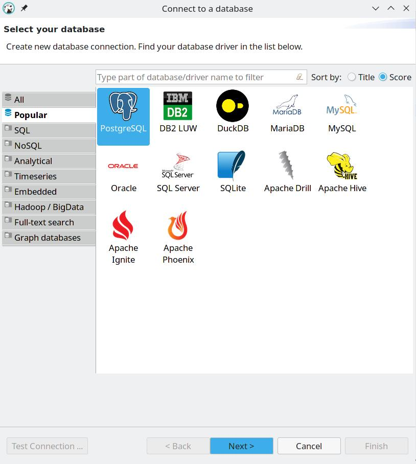
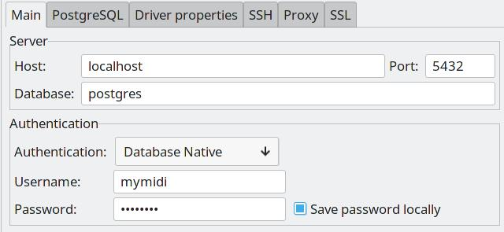
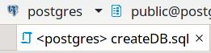
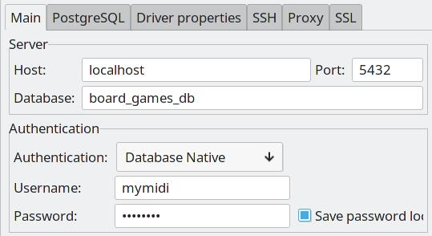

# Настройки и использование

Небольшая инструкция по настройке postgres и dbeaver без боли и страданий.

## Установка postgres

Я решила не использовать docker, так как после выключения контейнера база
исчезала, а разбираться, как это починить, не хотела. В коммитах можешь найти
файл docker-compose.yml, настроенный и на postgres и на pgadmin.

Установка проста (это для Manjaro):
```
$ sudo pacman -S postgres
```

## Настройка postgres

Да, на установке дело не заканчивается :(

И так, при установке создался новый пользователь postgres, под которым надо
зайти, чтобы сделать настройки.

Меняем пользователя:
```
$ sudo -iu postgres
```

Иницилизируем кластер (директория стандартная, менять не нужно):
```
[postgres]$ initdb -D /var/lib/postgres/data
```

Выходим из пользователя postgres:
```
[postgres]$ exit
```

Далее запускаем и разрешаем автоматический запуск postgres при включении:
```
$ sudo systemctl start postgres.service
$ sudo systemctl enable postgres.service
```

Снова заходим под пользователя postgres и создаем нового пользователя (можно не
создавать, или создать потом с помощью скриптов):
```
[postgres]$ createuser --interactive -P
```

После запуска появятся несколько вопросов (имя пользователя, пароль (так как
мы указали флаг `-P`), и предоставить ли пользователю права суперпользователя,
я предоставляла).

Чтобы к пользователю можно было подключиться, создаем базу данных, на
которую пользователь будет иметь права чтения/записи:
```
[postgres]$ createdb mymidi
```
Ура!!! Все запущено, можно работать!

## Настройка dbeaver

Почему dbeaver:

* open-sourse;
* туда можно поставить vim-плагин.

Как для начинающего пользователя это пока все :).

При запуске появлется окно:



Выбираем `postgres`, нажимаем `Next`.

Настраиваем соединение следующим образом (можно указать базу данных созданного нами пользователя):



Будет примерно такой вид:


Теперь можно и нужно выполнить скрип создания БД. Я верю, что ты сможешь
самостоятельно открыть и запустить скрипт, проверь только, что слева от
названия скрипта стоит нужное подключение, изменить его можно выбрав скрипт и
изменив в выпадающем списке чуть выше рядом со слоником подключение на текущее.



Для того, чтобы увидеть созданную БД перейди к левой панели (надо, чтобы она
была активна, иначе не сработает) и нажми F5. Теперь картина должна выглядеть
так:


Теперь надо подключиться к созданной БД:



Все готово! Открывай свои скрипты, проверяй, что они выполняются в нужном
подключении, и наслаждайся!

## Выполнение ЛР

### Через dbeaver

Так получилось, что самая сложная часть (подключение к БД)
выполнения этой ЛР входит в настройку.

Есть только пара моментов:
* скрипт создания БД должен выполняться при подключении к другой БД;
* так как скрипт содержит запрос удаления БД, к ней не должно быть подключений,
  для этого `ПКМ -> Disconnect` по подключению с таким же названием, как и у
нашей БД;
* скрипты создания таблиц и копирования выполняются при подключении к созданной
  БД;
* таблицы находятся в `<имя_бд> -> Schemas -> public -> Tables`.

### Через командную строку

Отключи соединения dbeaver при запуске скрипта создания, так как он удаляет
БД, что нельзя сделать при существующем подключении.

* Подключаемся к нашему пользователю:
```
$ psql -U mymidi
```
* Просматриваем список баз:
```
mymidi-# \l
```

* Запускаем скрипт создания нашей БД (путь к файлу от текущей директории):
```
mymidi-# \i queries/createDB.sql 
DROP DATABASE
CREATE DATABASE
```

* Просматриваем список баз, в нем должна появиться строка с именем нашей БД:
```
mymidi-# \l
                                    List of databases
      Name      |  Owner   | Encoding |   Collate   |    Ctype    |   Access privileges   
----------------+----------+----------+-------------+-------------+-----------------------
 board_games_db | mymidi   | UTF8     | en_US.UTF-8 | en_US.UTF-8 | 
...
```

* Подключаемся к БД:
```
mymidi-# \c board_games_db 
You are now connected to database "board_games_db" as user "mymidi".
```

* Просматриваем список таблиц (сейчас в нем ничего нет):
```
board_games_db-# \d
Did not find any relations.
```

* Выполняем скрипт с запросами по созданию таблиц:
```
board_games_db-# \i queries/createTables.sql 
CREATE EXTENSION
CREATE TABLE
CREATE TABLE
CREATE TABLE
CREATE TABLE
CREATE TABLE
```

* Теперь в базе есть таблицы:
```
board_games_db-# \d
              List of relations
 Schema |       Name        | Type  | Owner  
--------+-------------------+-------+--------
 public | board_game_events | table | mymidi
 public | board_games       | table | mymidi
 public | game_event        | table | mymidi
 public | organizers        | table | mymidi
 public | venues            | table | mymidi
(5 rows)
```

* Проверяем, что в таблицах ничего нет:
```
board_games_db=# select * from venues;
 venue_id | venue_name | vanue_type | city | phone | site | email 
----------+------------+------------+------+-------+------+-------
(0 rows)
```

* Производим массовое копирование данных, запуская соответствующий скрипт:
```
board_games_db=# \i queries/copyData.sql 
COPY 3000
COPY 1000
COPY 1000
COPY 2000
COPY 6000
```

* Проверяем, что теперь в таблицах есть данные:
```
board_games_db=# select * from venues;
```
* Отключаемся и выходим 😊:
```
board_games_db=# \q
```
